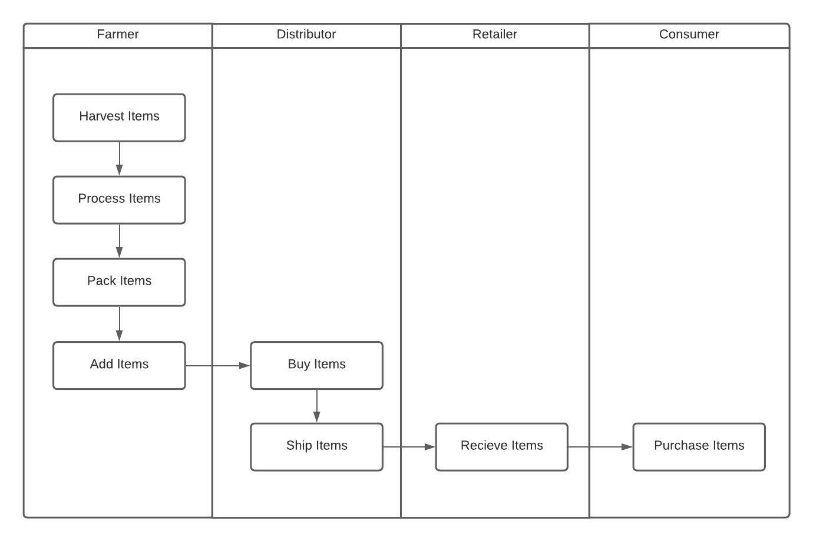
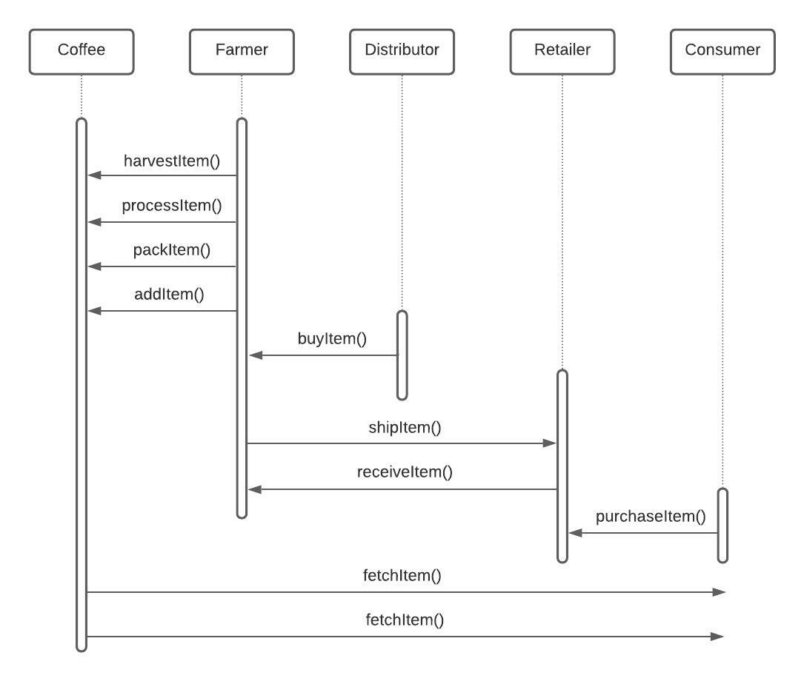
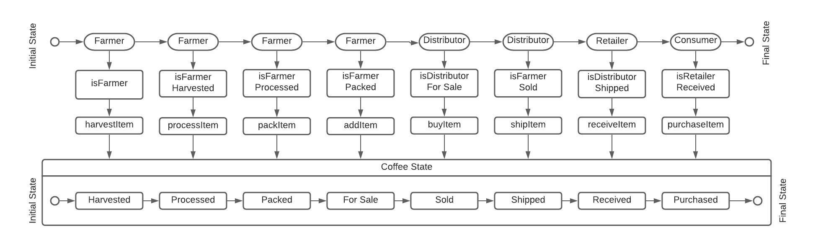
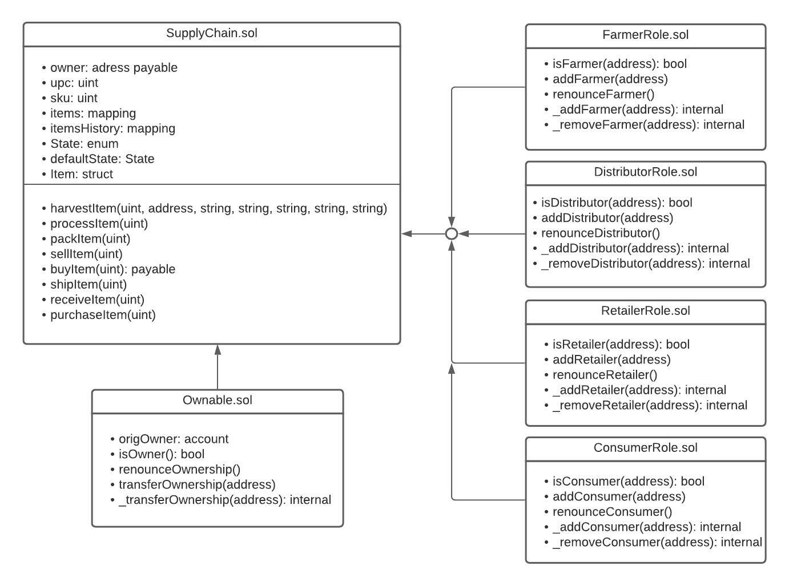

**Project: Supply Chain and Data Auditing**

This is the sixth project of the Udacity Blockchain Nanodegree. This repository contains an Ethereum DApp that demonstrates a Supply Chain flow between a Seller and Buyer. The user story is similar to any commonly used supply chain process.

A Seller can add items to the inventory system stored in the blockchain. A Buyer can purchase such items from the inventory system. Additionally a Seller can mark an item as Shipped, and similarly a Buyer can mark an item as Received.

The DAPP is deployed to the public Rinkeby Ethereum test network at the contract address:  
https://rinkeby.etherscan.io/tx/0xa53d076ea78fe37943931a6f002ea8a1459b979295410bb5222fed40ff47a1ad

Versions:

1. Truffle v4.1.14
2. Ganache CLI v6.12.2

## Requirement 1: Project write-up UML

### Activity Diagram


### Sequence Diagram


### State Diagram


### Class Diagram (Data Model)


## Requirement 2: Project write-up - Libraries

I used a library called Roles which made it easier to manage AccessControl in my DAPP. It made it easy to add and remove roles in each of my AccessControl contracts (FarmerRole.sol, DistributorRole.sol, RetailerRole.sol, and ConsumerRole.sol).

## Requirement 3: Project write-up - IPFS
I did not use IPFS to deliver my website for this project. However, I plan to add my HTML, CSS, and JS files to IPFS in order to fully decentralize my Supply Chain DAPP.

## Getting Started

These instructions will get you a copy of the project up and running on your local machine for development and testing purposes. See deployment for notes on how to deploy the project on a live system.

## Prerequisites

Please make sure you've already installed ganache-cli, Truffle and enabled MetaMask extension in your browser.

```
Give examples (to be clarified)
```

## Installing

A step by step series of examples that tell you have to get a development env running.

Clone this repository:

```
git clone https://github.com/udacity/nd1309/tree/master/course-5/project-6
```

Change directory to ```project-6``` folder and install all requisite npm packages (as listed in ```package.json```):

```
cd project-6
npm install
```

Launch Ganache:

```
ganache-cli -m "spirit supply whale amount human item harsh scare congress discover talent hamster"
```

In a separate terminal window, Compile smart contracts:

```
truffle compile
```

This will create the smart contract artifacts in folder ```build\contracts```.

Migrate smart contracts to the locally running blockchain, ganache-cli:

```
truffle migrate
```

Your terminal should look something like this:

Test smart contracts:

```
truffle test
```

All 10 tests should pass.

In a separate terminal window, launch the DApp:

```
npm run dev
```
